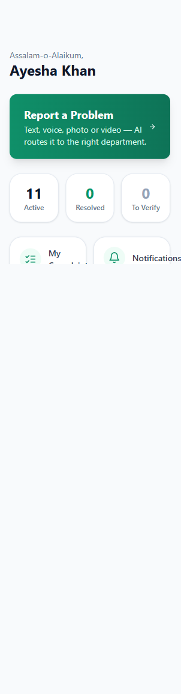
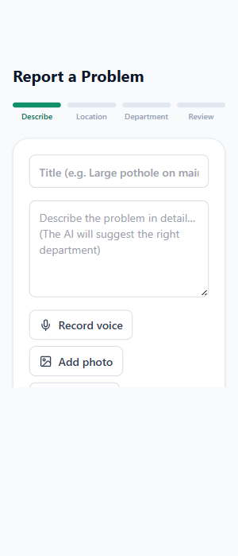
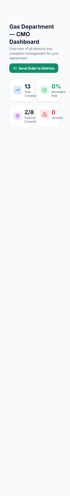
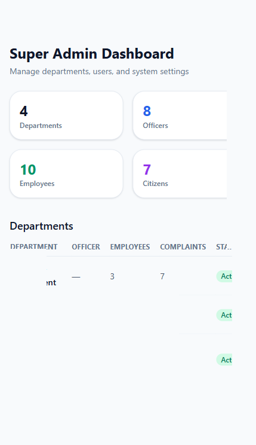

<div align="center">

# 📢 Pukar — پکار

### *آپ کی آواز ، ایک بہتر کل کی بنیاد*
**From Complaints to Action — Detect. Prioritize. Resolve. Prevent.**

[](https://ppr-ai.vercel.app)
[](https://nextjs.org/)
[](https://www.typescriptlang.org/)
[](https://tailwindcss.com/)
[](./LICENSE)

**Pukar** is an AI-powered public complaint management platform designed for Pakistani local government. It transforms how citizens report problems and how authorities respond — with intelligent routing, duplicate detection, SLA tracking, and predictive risk analysis.

[🚀 Live Demo](https://ppr-ai.vercel.app) • [📖 Documentation](#-documentation) • [🛠️ Tech Stack](#-tech-stack) • [📸 Screenshots](#-screenshots)

---

</div>

## ✨ What Makes Pukar Different?

Pukar isn't just another complaint form. It's a **complete intelligent governance system** that:

- 🧠 **Understands complaints** — AI classifies, prioritizes, and routes automatically
- 🗺️ **Maps problems geographically** — Live maps with complaint clustering
- 🔁 **Detects duplicates** — Groups similar complaints into "Master Problems"
- ⏱️ **Tracks SLAs** — Automatic escalation when deadlines are breached
- 📊 **Predicts risks** — Emerging risk radar for proactive governance
- 🌐 **Bilingual** — Full English/Urdu support with RTL layout
- 📱 **Mobile-first** — Works beautifully on any device

---

## 🎯 Key Features

### For Citizens 👥
- **Multi-step complaint wizard** — Text, voice, photo, video, map-based location
- **Real-time tracking** — Live status updates with timeline visualization
- **Verification system** — Confirm if problems are actually resolved
- **Safety alerts** — Receive emergency notifications in your area
- **Problems near me** — Discover reported issues on interactive maps

### For Government Officers 👔
- **Role-based dashboards** — Officer, CMO, CM, Admin — each with relevant insights
- **AI-powered triage** — Automatic classification and priority assignment
- **SLA management** — Track deadlines and prevent breaches
- **Master Problems** — See clustered complaints as unified issues
- **Broadcast system** — Send announcements to citizens
- **Risk radar** — Predictive analysis for emerging problem areas

### For Leadership 🏛️
- **Executive briefs** — AI-generated summaries from real data
- **District overview** — Cross-district health monitoring
- **Performance analytics** — Department-wise resolution rates
- **Complaint maps** — Geographic visualization of all issues
- **Emergency alerts** — Issue flood risk, safety warnings, etc.

---

## 🛠️ Tech Stack

| Layer | Technology |
|-------|------------|
| **Frontend** | Next.js 14 (App Router), React 18, TypeScript |
| **Styling** | Tailwind CSS, custom animations |
| **Maps** | Leaflet, OpenStreetMap (no API key needed) |
| **Charts** | Recharts for analytics visualization |
| **Database** | Turso Cloud SQLite (async, serverless-ready) |
| **AI** | Deterministic offline engine + optional OpenAI |
| **Auth** | Custom session cookies with scrypt hashing |
| **Icons** | Lucide React |
| **Deployment** | Vercel (serverless) |

---

## 📸 Screenshots

<details>
<summary><b>🏠 Citizen Dashboard</b></summary>
<br>



</details>

<details>
<summary><b>📝 Report a Problem</b></summary>
<br>



</details>

<details>
<summary><b>👔 CMO Dashboard</b></summary>
<br>



</details>

<details>
<summary><b>🏛️ Admin Console</b></summary>
<br>



</details>

---

## 🚀 Quick Start

### Prerequisites
- Node.js 22+ (for built-in `node:sqlite` module)
- npm, yarn, or pnpm

### Installation

```bash
# Clone the repository
git clone https://github.com/numan046/pukar.git
cd pukar

# Install dependencies
npm install

# Set up environment variables
cp .env.example .env.local
# Edit .env.local with your Turso credentials (optional)

# Seed the database with demo data
npm run db:seed

# Start development server
npm run dev
```

Open [http://localhost:3000](http://localhost:3000) in your browser.

### Demo Accounts

All demo accounts use password: **`Demo@1234`**

| Role | Email | Access |
|------|-------|--------|
| 👤 Citizen | `citizen@ppr.ai` | Report complaints, track status |
| 👮 Department Officer | `gas-officer-sialkot@ppr.ai` | Manage department complaints |
| 👔 CMO | `gas-cmo@ppr.ai` | Cross-district oversight |
| 🏛️ CM | `cm@ppr.ai` | Executive overview & analytics |
| 🔧 Admin | `admin@ppr.ai` | System administration |

---

## 📖 Documentation

### Project Structure

```
pukar/
├── scripts/
│   ├── schema.sql          # Database schema (SQLite/Postgres-portable)
│   ├── seed.ts             # Demo data seeder
│   └── migrate.ts          # Database migration script
├── src/
│   ├── app/
│   │   ├── api/            # Backend API routes (see below)
│   │   ├── citizen/        # Citizen-facing pages
│   │   ├── officer/        # Department officer dashboard
│   │   ├── cmo/            # CMO dashboard
│   │   ├── cm/             # CM dashboard
│   │   └── admin/          # Admin console
│   ├── components/         # Shared UI components
│   ├── lib/
│   │   ├── ai/            # AI classification & analysis
│   │   ├── db/            # Database client & repository
│   │   ├── auth.ts        # Authentication logic
│   │   ├── workflow.ts    # Complaint workflow engine
│   │   └── i18n.ts        # Internationalization (EN/UR)
│   └── types/             # TypeScript type definitions
└── public/                # Static assets
```

### API Endpoints

All API routes are in `/src/app/api/`. Key endpoints:

<details>
<summary><b>🔐 Authentication</b></summary>

| Endpoint | Method | Description |
|----------|--------|-------------|
| `/api/auth/login` | POST | User login |
| `/api/auth/signup` | POST | Citizen registration |
| `/api/auth/logout` | POST | Clear session |
| `/api/auth/me` | GET | Current user data |

</details>

<details>
<summary><b>📋 Complaints</b></summary>

| Endpoint | Method | Description |
|----------|--------|-------------|
| `/api/complaints` | GET | List complaints (role-filtered) |
| `/api/complaints` | POST | Submit new complaint |
| `/api/complaints/[id]` | GET | Complaint details |
| `/api/complaints/[id]/assign` | POST | Assign to employee |
| `/api/complaints/[id]/verify` | POST | Citizen verification |
| `/api/complaints/[id]/resolve` | POST | Mark resolved |

</details>

<details>
<summary><b>🏢 Departments & Employees</b></summary>

| Endpoint | Method | Description |
|----------|--------|-------------|
| `/api/departments` | GET/POST | List/create departments |
| `/api/employees` | GET/POST | List/create employees |
| `/api/districts` | GET | List districts |

</details>

<details>
<summary><b>📊 Analytics & AI</b></summary>

| Endpoint | Method | Description |
|----------|--------|-------------|
| `/api/cm/analytics` | GET | CM dashboard data |
| `/api/cmo/analytics` | GET | CMO dashboard data |
| `/api/ask-ai` | POST | AI chatbot query |
| `/api/executive-brief` | GET | AI-generated brief |
| `/api/risk-signals` | GET | Predictive risk data |

</details>

**Note:** All endpoints except `/api/auth/login`, `/api/auth/signup` require authentication.

---

## 🌍 Deployment

### Deploy to Vercel (Recommended)

```bash
# Install Vercel CLI
npm install -g vercel

# Deploy
vercel --prod
```

### Environment Variables

| Variable | Required | Description |
|----------|----------|-------------|
| `TURSO_DATABASE_URL` | Yes | Turso database URL |
| `TURSO_AUTH_TOKEN` | Yes | Turso auth token |
| `SESSION_SECRET` | Yes | Secret for signing session cookies |
| `OPENAI_API_KEY` | No | Enables real AI classification |

---

## 🔒 Security

- **Session cookies** — HTTP-only, signed with HMAC-SHA256
- **Password hashing** — scrypt with random salts
- **Role-based access** — Every API endpoint enforces authorization
- **Rate limiting** — Protection against brute force attacks
- **CSP headers** — Content Security Policy via middleware
- **No secrets in code** — All sensitive data in environment variables

---

## 🗺️ Roadmap

- [ ] Push notifications (PWA)
- [ ] Citizen mobile app (React Native)
- [ ] Advanced AI with multi-language support
- [ ] Integration with government GIS systems
- [ ] Social media complaint ingestion
- [ ] Automated SLA breach notifications via SMS

---

## 🤝 Contributing

Contributions are welcome! Please:

1. Fork the repository
2. Create a feature branch (`git checkout -b feature/amazing-feature`)
3. Commit your changes (`git commit -m 'Add amazing feature'`)
4. Push to the branch (`git push origin feature/amazing-feature`)
5. Open a Pull Request

---

## 📄 License

This project is licensed under the MIT License — see the [LICENSE](./LICENSE) file for details.

---

## 🙏 Acknowledgments

- **Next.js** team for the amazing framework
- **Turso** for cloud SQLite hosting
- **Leaflet** for open-source maps
- **Pakistani local government** for the inspiration and requirements

---

## 📞 Contact

**Live Demo**: [https://ppr-ai.vercel.app](https://ppr-ai.vercel.app)  
**Repository**: [https://github.com/numan046/pukar](https://github.com/numan046/pukar)

---

<div align="center">

**Made with ❤️ for better governance**

*If this project helps even one citizen get their problem resolved, it's worth it.*

[⭐ Star this repo](https://github.com/numan046/pukar) if you find it useful!

</div>
