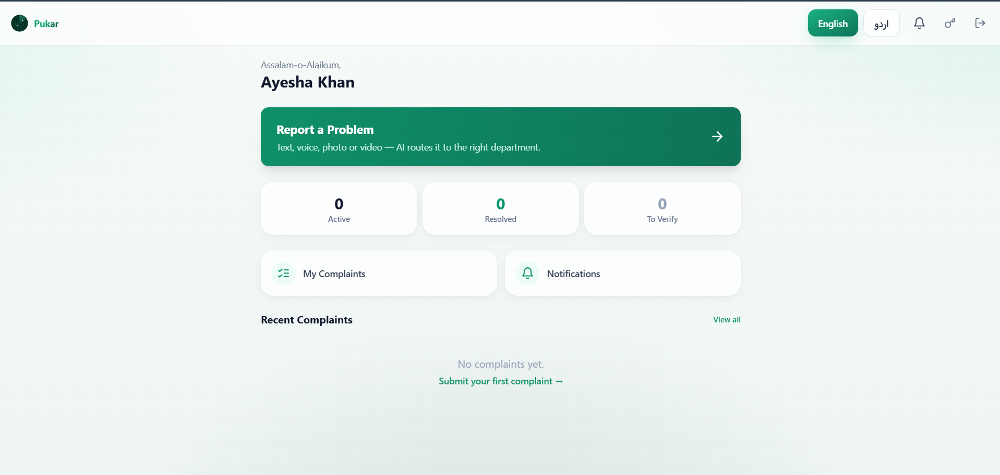
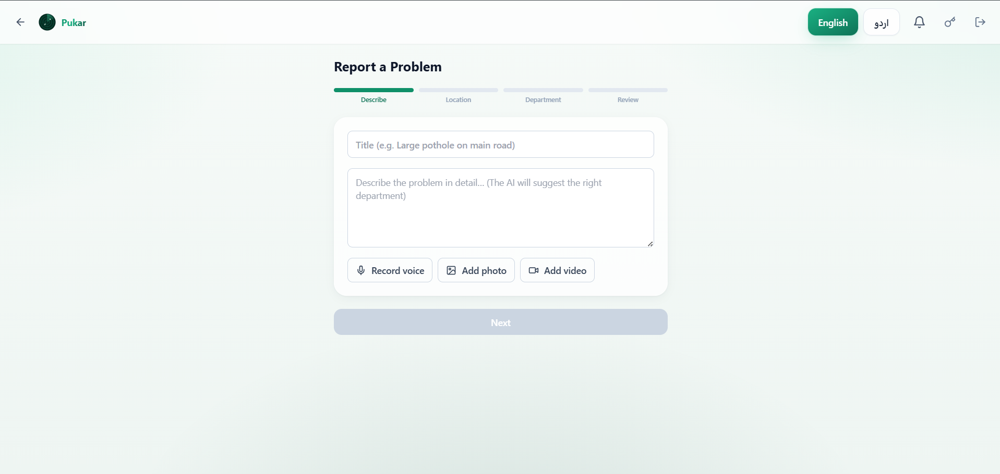
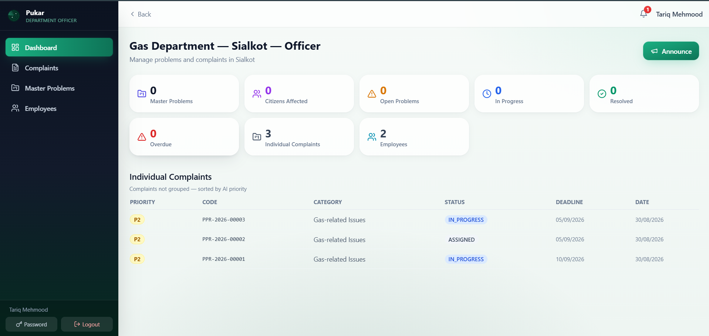
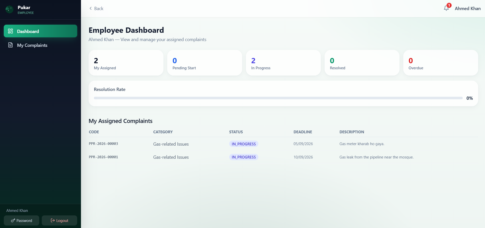
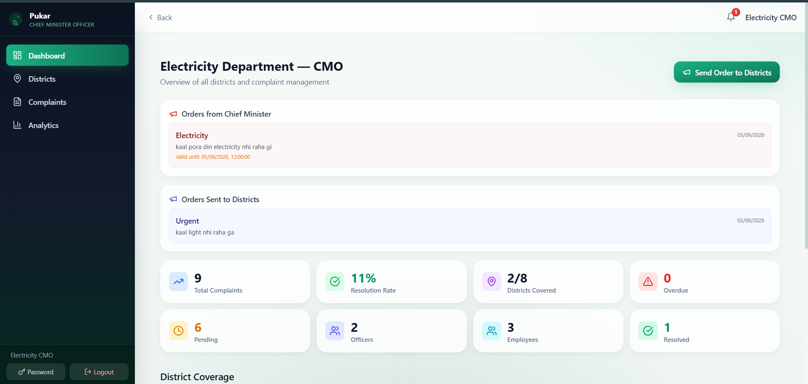
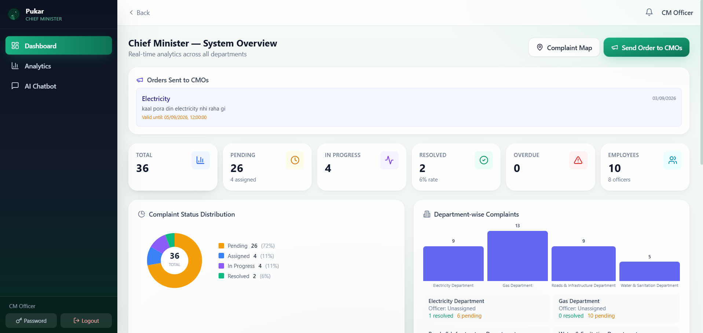
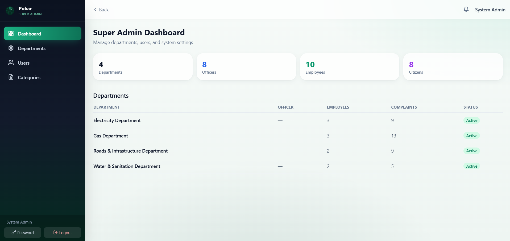

<div align="center">

# 📢 PUKAR: AI-Powered Infrastructure Monitoring System

### *پکار — آپ کی آواز ، ایک بہتر کل کی بنیاد*
**From Complaints to Action — Detect. Prioritize. Resolve. Prevent.**

[](https://ppr-ai.vercel.app)
[](https://nextjs.org/)
[](https://www.typescriptlang.org/)
[](https://tailwindcss.com/)
[](./LICENSE)

**Pukar** is an AI-powered infrastructure monitoring and public complaint management platform designed for Pakistani local government. It transforms how citizens report infrastructure problems — gas leaks, electricity faults, road damage, and water issues — and how authorities respond, with intelligent routing, duplicate detection into Master Problems, SLA tracking, and predictive risk analysis.

[🚀 Live Demo](https://ppr-ai.vercel.app) • [📖 Documentation](#-documentation) • [🛠️ Tech Stack](#-tech-stack) • [📸 Screenshots](#-screenshots)

---

</div>

## ✨ What Makes Pukar Different?

Pukar isn't just another complaint form. It's a **complete intelligent governance system** that:

- 🧠 **Understands complaints** — Deterministic AI classifies complaints into 4 infrastructure categories (Gas, Electricity, Roads, Water) with keyword matching across English, Roman Urdu, and Urdu script
- 🗺️ **Maps problems geographically** — Live Leaflet maps with complaint clustering and Pakistan boundary visualization
- 🔁 **Detects duplicates** — Groups similar complaints into "Master Problems" with unified tracking codes
- ⏱️ **Tracks SLAs** — Automatic escalation when deadlines are breached; CMO notified for unassigned complaints after 24 hours
- 📊 **Predicts risks** — Emerging risk radar for proactive governance
- 🌐 **Bilingual** — Full English/Urdu support with RTL layout and language switcher
- 📱 **Mobile-first** — Responsive design that works beautifully on any device
- 🔔 **Toast notifications** — Visual feedback for all officer actions (assign, reassign, dispute resolution)
- 📢 **Broadcast system** — Send announcements and emergency alerts to citizens
- 🔍 **AI Chatbot** — Query complaint data in natural language via the CM chatbot

---

## 🎯 Key Features

### For Citizens 👥
- **Multi-step complaint wizard** — Text description, voice recording, photo/video upload, map-based location
- **Phone number registration** — Citizens add phone number during signup for direct contact
- **Real-time tracking** — Live status updates with progress timeline visualization
- **Verification system** — Confirm if problems are actually resolved
- **Safety alerts** — Receive emergency broadcast notifications in your area
- **Problems near me** — Discover reported issues on interactive Leaflet map
- **Profile management** — View and manage personal information including phone number
- **Change password** — Secure password change with current password verification

### For Government Employees 👷
- **Employee dashboard** — View assigned complaints with KPI cards (Pending, In Progress, Resolved)
- **Complaint detail** — Full complaint information with media viewer (photos, videos, voice recordings)
- **Status updates** — Update complaint progress with notes
- **Drill-down modals** — Click KPI cards to view filtered complaints in popup overlays

### For Department Officers 👔
- **Role-based dashboard** — Department-scoped complaint management with KPI analytics
- **AI-powered triage** — Automatic classification into Gas, Electricity, Roads, or Water categories
- **Master Problems** — View clustered duplicate complaints as unified infrastructure issues
- **Employee assignment** — Assign complaints to field employees with deadlines and instructions
- **Dispute resolution** — Reassign complaints or take corrective actions with audit notes
- **SLA management** — Track deadlines and prevent breaches
- **Toast notifications** — Instant visual feedback on assign/reassign/dispute actions
- **Broadcast system** — Send announcements to citizens in their area

### For CMO (Chief Monitoring Officer) 👔
- **Cross-district oversight** — Monitor complaints across all districts in their department
- **District drill-down** — Click districts to view complaints, officers, and employees
- **Officer management** — View and track department officers performance
- **Analytics dashboard** — Department-wise complaint analytics with charts
- **Complaint detail** — Deep-dive into individual complaints with full media

### For Leadership (CM) 🏛️
- **Executive dashboard** — 1266-line comprehensive dashboard with hierarchical drill-down
- **Employee hierarchy drill-down** — Departments → CMOs → Officers → Employees with modal popups
- **Pakistan complaint map** — Geographic visualization with status-colored markers
- **AI chatbot** — Query complaint data in natural language
- **Performance analytics** — Department-wise resolution rates and trends
- **Emergency alerts** — Issue flood risk, safety warnings, etc.
- **Risk radar** — Predictive analysis for emerging problem areas

### For Admin 🔧
- **User management** — Manage all system users with role-based filtering
- **Department management** — Create and configure government departments
- **Category management** — Administer complaint categories (CEESA: Gas, Electricity, Roads, Water)
- **System oversight** — Complete administrative control

---

## 🛠️ Tech Stack

| Layer | Technology |
|-------|------------|
| **Frontend** | Next.js 14 (App Router), React 18, TypeScript |
| **Styling** | Tailwind CSS 3, custom green gradient theme, aurora animations |
| **Maps** | Leaflet, OpenStreetMap (no API key needed) |
| **Charts** | Recharts for analytics visualization |
| **Database** | Turso Cloud SQLite (async, serverless-ready) |
| **AI** | Deterministic offline engine (keyword-based classification) + optional Groq/OpenAI |
| **Auth** | Custom session cookies with scrypt hashing and HMAC-SHA256 signing |
| **Icons** | Lucide React |
| **Deployment** | Vercel (serverless) |

---

## 📸 Screenshots

<details>
<summary><b>🏠 Citizen Dashboard</b></summary>
<br>



</details>

<details>
<summary><b>📝 Report a Problem</b></summary>
<br>



</details>

<details>
<summary><b>👮 Department Officer Dashboard</b></summary>
<br>



</details>

<details>
<summary><b>👷 Employee Dashboard</b></summary>
<br>



</details>

<details>
<summary><b>👔 CMO Dashboard</b></summary>
<br>



</details>

<details>
<summary><b>🏛️ Chief Minister Dashboard</b></summary>
<br>



</details>

<details>
<summary><b>🔧 Super Admin Dashboard</b></summary>
<br>



</details>

---

## 🚀 Quick Start

### Prerequisites
- Node.js 22+ (for built-in `node:sqlite` module)
- npm, yarn, or pnpm

### Installation

```bash
# Clone the repository
git clone https://github.com/numan046/pukar-app.git
cd pukar-app

# Install dependencies
npm install

# Set up environment variables
cp .env.example .env.local
# Edit .env.local with your Turso credentials (optional — app works with seed data)

# Seed the database with demo data
npm run db:seed

# Start development server
npm run dev
```

Open [http://localhost:3000](http://localhost:3000) in your browser.

### Demo Accounts

All demo accounts use password: **`Demo@1234`**

| Role | Email | Access |
|------|-------|--------|
| 👤 Citizen | `citizen@ppr.ai` | Report complaints, track status, view nearby problems |
| 👷 Employee | `gas-emp1-sialkot@ppr.ai` | View assigned complaints, update status |
| 👮 Department Officer | `gas-officer-sialkot@ppr.ai` | Manage department complaints, assign employees |
| 👔 CMO | `gas-cmo@ppr.ai` | Cross-district oversight, officer management |
| 🏛️ CM | `cm@ppr.ai` | Executive overview, analytics, chatbot |
| 🔧 Admin | `admin@ppr.ai` | System administration, user management |

> Additional demo accounts exist for all 4 departments (Gas, Electricity, Roads, Water) across multiple districts (Sialkot, Gujranwala, Lahore, Multan, Faisalabad).

---

## 📖 Documentation

### Project Structure

```
pukar-app/
├── scripts/
│   ├── schema.sql              # Database schema (SQLite/Turso-portable)
│   ├── seed.ts                 # Demo data seeder (25+ users, sample complaints)
│   └── migrate.ts              # Database migration script
├── src/
│   ├── app/
│   │   ├── api/                # Backend API routes (41 endpoints)
│   │   │   ├── auth/           # Login, signup, logout, session, change-password
│   │   │   ├── complaints/     # CRUD, assign, verify, resolve, dispute, progress
│   │   │   ├── master-problems/# Duplicate grouping and management
│   │   │   ├── cm/             # Analytics, chatbot, complaint map, employee hierarchy
│   │   │   ├── cmo/            # Analytics, complaints, districts, officers
│   │   │   ├── departments/    # Department CRUD, officer assignment
│   │   │   ├── employees/      # Employee CRUD
│   │   │   ├── broadcasts/     # Citizen announcements
│   │   │   ├── notifications/  # User notifications
│   │   │   ├── categories/     # CEESA complaint categories
│   │   │   └── upload/         # Media file upload
│   │   ├── citizen/            # Citizen-facing pages
│   │   │   ├── page.tsx        # Dashboard with KPI cards + modal drill-down
│   │   │   ├── report/         # Multi-step complaint wizard (text, voice, photo, video)
│   │   │   ├── complaints/     # Complaint list + detail with media viewer
│   │   │   ├── alerts/         # Broadcast notifications
│   │   │   ├── near-me/        # Leaflet map of nearby complaints
│   │   │   └── profile/        # Personal info management
│   │   ├── employee/           # Employee dashboard
│   │   │   ├── page.tsx        # KPI cards + complaint table + modal drill-down
│   │   │   └── complaints/     # Assigned complaint list + detail
│   │   ├── officer/            # Department officer dashboard
│   │   │   ├── page.tsx        # KPI analytics + modal drill-down
│   │   │   ├── complaints/     # Department complaints list + detail with assign/dispute
│   │   │   ├── master-problems/# Master Problem list + detail with employee assignment
│   │   │   └── employees/      # Department employee grid
│   │   ├── cmo/                # CMO dashboard
│   │   │   ├── page.tsx        # District overview + modal drill-down
│   │   │   ├── complaints/     # Cross-district complaints + detail
│   │   │   ├── districts/      # District management
│   │   │   └── analytics/      # Department analytics with charts
│   │   ├── cm/                 # CM dashboard
│   │   │   ├── page.tsx        # Executive dashboard with hierarchy drill-down
│   │   │   ├── analytics/      # Performance analytics
│   │   │   └── chatbot/        # AI chatbot interface
│   │   ├── admin/              # Admin console
│   │   │   ├── page.tsx        # Admin overview
│   │   │   ├── users/          # User management
│   │   │   ├── departments/    # Department management
│   │   │   └── categories/     # Category management
│   │   └── notifications/      # Shared notification center
│   ├── components/
│   │   ├── ui.tsx              # Core UI primitives (Button, Card, KpiCard, Modal, etc.)
│   │   ├── Brand.tsx           # Pukar logo and wordmark components
│   │   ├── badges.tsx          # Status and priority badge components
│   │   ├── AskAiPanel.tsx      # AI chatbot panel
│   │   ├── RiskRadarPanel.tsx  # Predictive risk radar
│   │   ├── ChangePasswordModal.tsx  # Password change modal
│   │   ├── LangProvider.tsx    # Language context provider
│   │   ├── LanguageSwitcher.tsx # EN/Urdu language toggle
│   │   ├── map/
│   │   │   ├── LeafletMap.tsx  # Dynamic Leaflet map component
│   │   │   └── MapClient.tsx   # Map client wrapper
│   │   └── nav/
│   │       ├── CitizenChrome.tsx   # Citizen navigation shell
│   │       └── GovChrome.tsx       # Government dashboard navigation shell
│   ├── lib/
│   │   ├── ai/
│   │   │   ├── classify.ts     # Deterministic CEESA classification (4 categories)
│   │   │   ├── duplicate.ts    # Duplicate detection and Master Problem linking
│   │   │   ├── askAi.ts        # Natural language query engine
│   │   │   ├── risk.ts         # Risk signal analysis
│   │   │   ├── verification.ts # Complaint verification logic
│   │   │   └── index.ts        # AI module exports
│   │   ├── db/
│   │   │   ├── client.ts       # Turso cloud database client
│   │   │   └── repo.ts         # Data access layer (575 lines, all queries)
│   │   ├── auth.ts             # Authentication (scrypt hashing, session management)
│   │   ├── workflow.ts         # Complaint state machine and SLA engine
│   │   ├── i18n.ts             # Internationalization (EN/UR dictionary)
│   │   ├── id.ts               # Unique ID generator (PPR-YYYY-XXXXX format)
│   │   ├── pakistan-boundary.ts # Pakistan GeoJSON boundary data
│   │   ├── punjab-boundary.ts  # Punjab province boundary data
│   │   └── utils.ts            # Shared utilities
│   ├── types/
│   │   └── index.ts            # TypeScript type definitions (237 lines)
│   ├── middleware.ts           # Security headers (CSP, HSTS, Permissions-Policy)
│   ├── layout.tsx             # Root layout
│   └── page.tsx               # Splash → Notice → Language → Auth flow
├── public/
│   ├── logo.png               # Pukar logo asset
│   └── favicon.ico
└── tailwind.config.ts         # Custom brand color palette with green gradients
```

### API Endpoints

All API routes are in `src/app/api/`. Key endpoints:

<details>
<summary><b>🔐 Authentication (5 endpoints)</b></summary>

| Endpoint | Method | Description |
|----------|--------|-------------|
| `/api/auth/login` | POST | User login with email/password |
| `/api/auth/signup` | POST | Citizen registration with phone number |
| `/api/auth/logout` | POST | Clear session cookie |
| `/api/auth/me` | GET | Current user session data |
| `/api/auth/change-password` | POST | Change password (requires current password) |

</details>

<details>
<summary><b>📋 Complaints (7 endpoints)</b></summary>

| Endpoint | Method | Description |
|----------|--------|-------------|
| `/api/complaints` | GET | List complaints (role-filtered by department/district) |
| `/api/complaints` | POST | Submit new complaint with media |
| `/api/complaints/[id]` | GET | Complaint details with full media |
| `/api/complaints/[id]/assign` | POST | Assign complaint to employee with deadline |
| `/api/complaints/[id]/verify` | POST | Citizen verification (resolved or not) |
| `/api/complaints/[id]/resolve` | POST | Mark complaint as resolved |
| `/api/complaints/[id]/dispute-action` | POST | Reassign or take corrective action |
| `/api/complaints/[id]/progress` | POST | Update complaint progress with notes |

</details>

<details>
<summary><b>🔧 Master Problems (3 endpoints)</b></summary>

| Endpoint | Method | Description |
|----------|--------|-------------|
| `/api/master-problems` | GET | List all master problems (grouped duplicates) |
| `/api/master-problems/[id]` | GET | Master problem details with linked complaints |
| `/api/master-problems/[id]` | POST | Assign employee to master problem |

</details>

<details>
<summary><b>🏢 Departments & Employees (6 endpoints)</b></summary>

| Endpoint | Method | Description |
|----------|--------|-------------|
| `/api/departments` | GET | List all departments |
| `/api/departments` | POST | Create new department |
| `/api/departments/[id]` | GET | Department details |
| `/api/departments/[id]` | PUT | Update department |
| `/api/departments/[id]/assign-officer` | POST | Assign officer to department |
| `/api/employees` | GET | List employees (department-filtered) |
| `/api/employees` | POST | Create new employee |
| `/api/employees/[id]` | GET/PUT | Employee details and updates |
| `/api/districts` | GET | List all districts |
| `/api/categories` | GET | List CEESA complaint categories |

</details>

<details>
<summary><b>📊 Analytics & AI (7 endpoints)</b></summary>

| Endpoint | Method | Description |
|----------|--------|-------------|
| `/api/cm/analytics` | GET | CM executive dashboard data |
| `/api/cm/chatbot` | POST | AI chatbot for natural language queries |
| `/api/cm/complaint-map` | GET | Pakistan complaint map with markers |
| `/api/cm/employee-hierarchy` | GET | Department → CMO → Officer → Employee tree |
| `/api/cmo/analytics` | GET | CMO department analytics |
| `/api/cmo/complaints` | GET | CMO cross-district complaints |
| `/api/cmo/districts` | GET | CMO district overview |
| `/api/cmo/officers` | GET | CMO officer list |
| `/api/ask-ai` | POST | General AI query engine |
| `/api/executive-brief` | GET | AI-generated executive summary |
| `/api/risk-signals` | GET | Predictive risk analysis data |

</details>

<details>
<summary><b>📢 Broadcasts & Notifications (2 endpoints)</b></summary>

| Endpoint | Method | Description |
|----------|--------|-------------|
| `/api/broadcasts` | GET | List broadcasts (role-filtered) |
| `/api/broadcasts` | POST | Create new broadcast/announcement |
| `/api/notifications` | GET | User notifications |

</details>

<details>
<summary><b>📤 Upload & Other (3 endpoints)</b></summary>

| Endpoint | Method | Description |
|----------|--------|-------------|
| `/api/upload` | POST | Media file upload (photo/video/voice) |
| `/api/lang` | POST | Save user language preference |
| `/api/seed` | POST | Re-seed database with demo data |

</details>

**Note:** All endpoints except `/api/auth/login`, `/api/auth/signup`, and `/api/seed` require authentication via session cookie.

---

## 🌍 Deployment

### Deploy to Vercel (Recommended)

```bash
# Install Vercel CLI
npm install -g vercel

# Deploy
vercel --prod
```

### Environment Variables

| Variable | Required | Description |
|----------|----------|-------------|
| `TURSO_DATABASE_URL` | Yes | Turso cloud database URL |
| `TURSO_AUTH_TOKEN` | Yes | Turso cloud auth token |
| `SESSION_SECRET` | Yes | Secret for signing session cookies (min 32 chars) |
| `OPENAI_API_KEY` | No | Enables real AI classification via Groq/OpenAI |
| `GOOGLE_MAPS_API_KEY` | No | Optional Google Maps integration |

---

## 🔒 Security

- **Session cookies** — HTTP-only, signed with HMAC-SHA256
- **Password hashing** — scrypt with random salts
- **Role-based access** — Every API endpoint enforces authorization checks
- **CSP headers** — Strict Content Security Policy via middleware
- **HSTS** — HTTP Strict Transport Security in production
- **Permissions-Policy** — Camera, microphone, and geolocation restricted to same-origin
- **X-Frame-Options** — Clickjacking protection (DENY)
- **X-Content-Type-Options** — MIME sniffing protection (nosniff)
- **No secrets in code** — All sensitive data in environment variables
- **IDOR protection** — Role-scoped data access prevents unauthorized data access

---

## 🗺️ Roadmap

- [ ] Push notifications (PWA)
- [ ] Citizen mobile app (React Native)
- [ ] Advanced AI with multi-language NLP support
- [ ] Integration with government GIS systems
- [ ] Social media complaint ingestion
- [ ] Automated SLA breach notifications via SMS
- [ ] Real-time complaint tracking websocket updates

---

## 🤝 Contributing

Contributions are welcome! Please:

1. Fork the repository
2. Create a feature branch (`git checkout -b feature/amazing-feature`)
3. Commit your changes (`git commit -m 'Add amazing feature'`)
4. Push to the branch (`git push origin feature/amazing-feature`)
5. Open a Pull Request

---

## 📄 License

This project is licensed under the MIT License — see the [LICENSE](./LICENSE) file for details.

---

## 🙏 Acknowledgments

- **Next.js** team for the amazing framework
- **Turso** for cloud SQLite hosting
- **Leaflet** for open-source maps
- **Pakistani local government** for the inspiration and requirements

---

## 📬 Contact

**Live Demo**: [https://ppr-ai.vercel.app](https://ppr-ai.vercel.app)  
**Repository**: [https://github.com/numan046/pukar-app](https://github.com/numan046/pukar-app)

---

<div align="center">

**Made with ❤️ for better governance**

*If this project helps even one citizen get their problem resolved, it's worth it.*

[⭐ Star this repo](https://github.com/numan046/pukar-app) if you find it useful!

</div>
